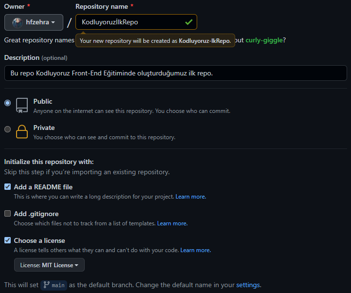

# Kodluyoruz İkinci Repo
Kodluyoruz Eğitimi kapsamında açtığım ikinci repo. İçersinde bir adet READ.md ve bir adet index.html dosyası bulunduruyor .



## İnstallation

Öncelikle projeyi klonlayın.(buraya sizin reponuzdan aldığınız link gelecek)

```
https://github.com/hfzehra/kodluyoruzilkrepo.git
```

## Usage

projeyi klonladıktan sonra Visual Studio Code uygulamasını açınız.

- Linux için 

```
cd kodluyoruzilkrepo
code .
```

## Lisence

[MIT](https://choosealicense.com/licenses/mit/)
